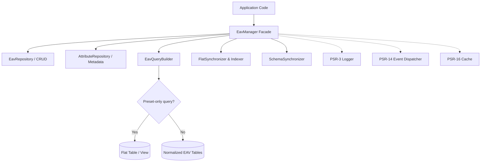

# Peav

[](https://php.net/)
[](https://www.doctrine-project.org/projects/dbal.html)
[](LICENSE)
[](phpstan.neon)
[](phpunit.xml.dist)


> **⚠️ WARNING:** This library is experimental and under active development.
> Breaking changes will occur frequently without prior notice. Use at your discretion.

**Peav** is a zero-friction, modular, and high-performance **Entity-Attribute-Value (EAV)** library for **PHP 8.4+** built on top of **Doctrine DBAL 4.x**. It bridges the flexibility of dynamic schema modeling with the query performance of relational databases through transparent flat read projections and typed value storage buckets.

---

## Key Features

- **Unified Facade (`EavManager`)**: A streamlined entry point for managing schema, metadata, entity CRUD, flat projections, and query building.
- **Typed Value Storage Buckets**: Dedicated, typed value tables (`eav_values_string`, `eav_values_int`, `eav_values_decimal`, `eav_values_datetime`, `eav_values_bool`, `eav_values_text`, `eav_values_json`, `eav_values_blob`) ensuring strong type safety and indexing efficiency.
- **Dual-Engine Dynamic Query Routing**: `EavQueryBuilder` routes queries to high-speed flat tables or SQL views for preset attributes, while seamlessly falling back to normalized EAV tables for arbitrary dynamic attributes.
- **Flat Read Projections**: Supports both physical flat tables (`PhysicalFlatTableStrategy`) and SQL views (`ViewFlatTableStrategy`) with real-time and batch synchronization (`FlatIndexer`).
- **Full PSR Interchangeability**: Native pluggability for PSR-3 (Logging), PSR-14 (Event Dispatching), and PSR-16 (SimpleCache) with built-in null adapters and factory defaults.
- **Developer Tooling & CLI**: Includes 7 console commands (`peav:schema:*`, `peav:flat:*`) with standalone binary (`bin/peav`) and framework integration via `PeavCommandProvider`.

---

## Architecture Overview



---

## Requirements

- **PHP**: `^8.4` (requires modern PHP 8.4 features like property hooks, constructor promotion, typed constants, and strict typing).
- **Doctrine DBAL**: `^4.0`.
- **Database Engine**: Compatible with all major relational engines supported by Doctrine DBAL:
  - SQLite 3.37+
  - MySQL 8.0+ / MariaDB 10.5+
  - PostgreSQL 14+

---

## Installation

Install the package via Composer:

```bash
composer require wiredupdev/peav
```

---

## Quick Start Guide

Here is a complete, self-contained example showing how to initialize `EavManager`, create the database schema, register metadata, persist entities, and query records:

```php
<?php

declare(strict_types=1);

require_once __DIR__ . '/vendor/autoload.php';

use Doctrine\DBAL\DriverManager;
use WireUpDev\Peav\EavManager;
use WireUpDev\Peav\Model\AttributeDefinition;
use WireUpDev\Peav\Model\EntityTypeDefinition;
use WireUpDev\Peav\Model\PresetAttribute;
use WireUpDev\Peav\Type\AttributeType;

// 1. Establish a Doctrine DBAL connection (SQLite in-memory for this example)
$connection = DriverManager::getConnection([
    'driver' => 'pdo_sqlite',
    'memory' => true,
]);

// 2. Initialize the EavManager facade
$manager = EavManager::create($connection);

// 3. Create all core EAV database schema tables
$manager->schema()->createSchema();

// 4. Define reusable global attributes
$sku = new AttributeDefinition('sku', AttributeType::String, 'Product SKU');
$price = new AttributeDefinition('price', AttributeType::Decimal, 'Product Price');
$inStock = new AttributeDefinition('in_stock', AttributeType::Boolean, 'Stock Availability');

$manager->attributes()->saveAttribute($sku);
$manager->attributes()->saveAttribute($price);
$manager->attributes()->saveAttribute($inStock);

// 5. Define an Entity Type and bind preset attributes
$productType = new EntityTypeDefinition(
    code: 'product',
    name: 'Product',
    description: 'E-commerce Product Catalog',
    presets: [
        'sku' => new PresetAttribute(attribute: $sku, isRequired: true, position: 1),
        'price' => new PresetAttribute(attribute: $price, isRequired: true, defaultValue: 0.0, position: 2),
        'in_stock' => new PresetAttribute(attribute: $inStock, isRequired: false, defaultValue: true, position: 3),
    ],
);
$manager->attributes()->saveEntityType($productType);

// 6. Synchronize flat read projection tables
$manager->flat()->syncEntityType($productType);

// 7. Create and persist entities
$item1 = $manager->createEntity('product', [
    'sku' => 'PHONE-101',
    'price' => 799.99,
    'in_stock' => true,
]);
$manager->save($item1);

$item2 = $manager->createEntity('product', [
    'sku' => 'LAPTOP-202',
    'price' => 1299.00,
    'in_stock' => false,
]);
$manager->save($item2);

// 8. Retrieve an entity by ID
$product = $manager->find('product', $item1->getId());
echo sprintf("Loaded product: %s ($%.2f)\n", $product->get('sku'), (float) $product->get('price'));

// 9. Query entities using the fluent query builder
$results = $manager->createQueryBuilder('product')
    ->whereAttribute('price', '>', 500.0)
    ->whereAttribute('in_stock', '=', true)
    ->orderByAttribute('price', 'DESC')
    ->getEntities();

foreach ($results as $item) {
    echo sprintf("- %s: $%.2f\n", $item->get('sku'), (float) $item->get('price'));
}
```

---

## Schema Management & Database Tables

Peav organizes data using a normalized, type-segregated relational storage model designed to prevent table bloating and maximize indexing efficiency.

### Standard EAV Tables

When initializing or migrating your database via `SchemaSynchronizer`, Peav creates the following tables (customizable via `TableConfig`):

| Table Name | Description |
|---|---|
| `eav_entity_types` | Registry of configured entity types (e.g., `product`, `customer`, `order`). |
| `eav_attributes` | Master catalog of reusable global attribute definitions. |
| `eav_entity_type_presets` | Pivot table mapping attributes to entity types with rules (required, default values, position). |
| `eav_entities` | Master entity records containing primary identifier, entity type foreign key, and timestamps. |
| `eav_values_string` | Value bucket for `string` and `guid` attributes. |
| `eav_values_int` | Value bucket for `integer` and `bigint` attributes. |
| `eav_values_decimal` | Value bucket for `decimal` and `float` attributes. |
| `eav_values_datetime` | Value bucket for `datetime_immutable` and `date_immutable` attributes. |
| `eav_values_bool` | Value bucket for `boolean` attributes. |
| `eav_values_text` | Value bucket for unbounded `text` attributes. |
| `eav_values_json` | Value bucket for structured `json` objects/arrays. |
| `eav_values_blob` | Value bucket for binary `blob` data. |

### Schema Synchronization with `SchemaSynchronizer`

You can inspect, generate, and execute schema migrations programmatically using `$manager->schema()`:

```php
$schema = $manager->schema();

// Create all required tables (pass true to drop existing tables first)
$schema->createSchema(dropFirst: false);

// Check if current database schema is up-to-date with Peav requirements
$isUpToDate = $schema->isUpToDate();

// Update schema by comparing existing tables against required EAV structure
$schema->updateSchema();

// Preview generated SQL DDL statements without executing
$createQueries = $schema->getCreateSchemaSql();
$migrationQueries = $schema->getMigrationSql();

// Inspect table existence and row counts
$tableStatus = $schema->getTableStatus();
/*
[
    'eav_entities' => ['name' => 'eav_entities', 'exists' => true, 'rowCount' => 1420],
    'eav_attributes' => ['name' => 'eav_attributes', 'exists' => true, 'rowCount' => 28],
    ...
]
*/

// Safely drop all Peav tables in correct foreign-key reverse order
$schema->dropSchema();
```

### Customizing Table Prefixes and Table Names (`TableConfig`)

If you want custom table names or a unique table prefix (e.g., `app_eav_`):

```php
use WireUpDev\Peav\Schema\TableConfig;

$tableConfig = new TableConfig(
    tablePrefix: 'app_eav_',
    // Optional specific overrides:
    entitiesTable: 'app_eav_entities',
    attributesTable: 'app_eav_attributes',
    entityTypesTable: 'app_eav_entity_types',
    flatTablePrefix: 'app_eav_flat_',
    flatViewPrefix: 'app_eav_view_',
);

$manager = EavManager::create(
    connection: $connection,
    tableConfig: $tableConfig,
);
```

---

## Metadata Modeling: Attributes & Entity Types

### Defining Attribute Definitions (`AttributeDefinition`)

An `AttributeDefinition` represents a globally reusable attribute. Attributes are defined independently of entity types and can be shared across multiple entities (e.g., `sku`, `created_by`, `status`).

```php
use WireUpDev\Peav\Model\AttributeDefinition;
use WireUpDev\Peav\Type\AttributeType;

$skuAttr = new AttributeDefinition(
    code: 'sku',
    type: AttributeType::String,
    name: 'Stock Keeping Unit',
    description: 'Unique product identifier code',
    validationRules: ['max_length' => 64],
);

$manager->attributes()->saveAttribute($skuAttr);
```

#### Native Attribute Types (`AttributeType`)

Peav provides 12 built-in types mapped to optimized database storage buckets:

| `AttributeType` Enum | DBAL Type | Storage Bucket | PHP Hydrated Type |
|---|---|---|---|
| `AttributeType::String` | `string` | `eav_values_string` | `string` |
| `AttributeType::Guid` | `guid` | `eav_values_string` | `string` |
| `AttributeType::Integer` | `integer` | `eav_values_int` | `int` |
| `AttributeType::BigInt` | `bigint` | `eav_values_int` | `int` / `string` |
| `AttributeType::Decimal` | `decimal` | `eav_values_decimal` | `float` / `string` |
| `AttributeType::Float` | `float` | `eav_values_decimal` | `float` |
| `AttributeType::DateTimeImmutable` | `datetime_immutable` | `eav_values_datetime` | `\DateTimeImmutable` |
| `AttributeType::DateImmutable` | `date_immutable` | `eav_values_datetime` | `\DateTimeImmutable` |
| `AttributeType::Boolean` | `boolean` | `eav_values_bool` | `bool` |
| `AttributeType::Text` | `text` | `eav_values_text` | `string` |
| `AttributeType::Json` | `json` | `eav_values_json` | `array` / `stdClass` |
| `AttributeType::Blob` | `blob` | `eav_values_blob` | `resource` / `string` |

### Defining Entity Types with Preset Attributes (`EntityTypeDefinition`)

An `EntityTypeDefinition` specifies an entity category (e.g., `product`, `customer`, `article`). You attach attributes as presets using `PresetAttribute`, defining whether they are required, have default values, or have display positions.

```php
use WireUpDev\Peav\Model\EntityTypeDefinition;
use WireUpDev\Peav\Model\PresetAttribute;

$productType = new EntityTypeDefinition(
    code: 'product',
    name: 'Product',
    description: 'Catalog products',
    presets: [
        'sku' => new PresetAttribute(
            attribute: $skuAttr,
            isRequired: true,
            defaultValue: null,
            position: 1,
            customMetadata: ['searchable' => true],
        ),
        'price' => new PresetAttribute(
            attribute: $priceAttr,
            isRequired: true,
            defaultValue: 0.00,
            position: 2,
        ),
        'in_stock' => new PresetAttribute(
            attribute: $inStockAttr,
            isRequired: false,
            defaultValue: true,
            position: 3,
        ),
    ],
);

$manager->attributes()->saveEntityType($productType);
```

#### Dynamically Modifying Entity Type Presets

`EntityTypeDefinition` is immutable. Use `withPreset()` or `withoutPreset()` to derive modified copies:

```php
$weightAttr = new AttributeDefinition('weight_kg', AttributeType::Float, 'Weight (kg)');
$manager->attributes()->saveAttribute($weightAttr);

// Attach a new preset attribute
$updatedType = $productType->withPreset(
    new PresetAttribute(attribute: $weightAttr, isRequired: false, defaultValue: 0.5)
);
$manager->attributes()->saveEntityType($updatedType);

// Remove a preset attribute
$typeWithoutWeight = $updatedType->withoutPreset('weight_kg');
$manager->attributes()->saveEntityType($typeWithoutWeight);
```

#### Custom Entity Classes

You can attach a custom PHP class (extending `EavEntity`) to an `EntityTypeDefinition` so that hydrated entities are automatically instantiated as that specific class:

```php
use WireUpDev\Peav\Model\EavEntity;

class ProductEntity extends EavEntity
{
    public function getSku(): ?string
    {
        return $this->get('sku');
    }

    public function getPrice(): float
    {
        return (float) $this->get('price', 0.0);
    }
}

$productType = new EntityTypeDefinition(
    code: 'product',
    name: 'Product',
    customClass: ProductEntity::class,
    presets: [ /* ... */ ],
);
$manager->attributes()->saveEntityType($productType);
```

---

## Entity Operations & CRUD

Peav provides an intuitive API for creating, persisting, reading, batch-hydrating, and deleting entities.

### Working with `EavEntity`

The `EavEntity` class acts as the domain object carrying both identity and dynamic attributes:

```php
// Create a new entity with default values applied from presets
$product = $manager->createEntity('product', [
    'sku' => 'LAPTOP-PRO-15',
    'price' => 1499.99,
]);

// Read attributes
$sku = $product->get('sku');
$tags = $product->get('tags', default: []); // returns default when not set

// Set attributes
$product->set('color', 'Space Gray');
$product->set('in_stock', true);

// Check attribute presence
if ($product->has('color')) {
    // ...
}

// Remove an attribute
$product->remove('color');

// Get all attributes as an associative array
$allAttributes = $product->all();

// Replace all attributes at once
$product->replaceAttributes([
    'sku' => 'LAPTOP-PRO-15',
    'price' => 1399.99,
    'in_stock' => true,
]);

// Timestamps and Identity
$id = $product->getId();
$createdAt = $product->getCreatedAt(); // \DateTimeInterface|null
$updatedAt = $product->getUpdatedAt(); // \DateTimeInterface|null
```

### Saving & Batch Saving Entities

Entities are persisted inside automatic database transactions. Saving handles inserting/updating the master entity record and synchronizing all value bucket tables.

```php
// Save a single entity (insert or update)
$manager->save($product);

// Batch save multiple entities in a single atomic transaction
$manager->saveMany([$product1, $product2, $product3]);
```

### Finding Entities

```php
// Find a single entity by primary key (returns null if not found)
$product = $manager->find('product', 42);

// Find and hydrate multiple entities in constant O(T) database queries
// (avoids N+1 query problems across attribute bucket tables)
$products = $manager->findMany('product', [10, 20, 30, 42]);
// Returns: array<int|string, EavEntity> keyed by entity ID
```

### Deleting Entities

Deleting an entity cascades and removes all associated attribute values across all typed storage buckets:

```php
// Delete by entity instance
$manager->delete($product);

// Delete directly by ID and entity type code
$manager->deleteById('product', 42);
```

---

## Querying with `EavQueryBuilder`

`EavQueryBuilder` provides an expressive, fluent interface for filtering, sorting, paginating, and hydrating entities.

```php
$qb = $manager->createQueryBuilder('product');
```

### Filtering Criteria

Peav supports a comprehensive suite of criteria methods:

```php
// Basic attribute comparisons (=, !=, >, >=, <, <=, LIKE, NOT LIKE)
$qb->whereAttribute('price', '<=', 999.99)
   ->whereAttribute('status', '=', 'active');

// OR conditions
$qb->orWhereAttribute('featured', '=', true);

// IN and NOT IN conditions
$qb->whereAttributeIn('brand', ['Apple', 'Dell', 'Lenovo'])
   ->whereAttributeNotIn('category_id', [13, 14]);

// BETWEEN range queries
$qb->whereAttributeBetween('price', 100.00, 500.00);

// NULL / NOT NULL checks
$qb->whereAttributeNotNull('published_at')
   ->whereAttributeNull('discount_code');

// Pattern matching (LIKE)
$qb->whereAttributeLike('name', 'MacBook%');

// Primary Key & Entity Properties
$qb->whereId(101)
   ->whereIdIn([101, 102, 103]);

// Timestamp filtering
$qb->whereCreatedAfter(new \DateTimeImmutable('2026-01-01'))
   ->whereUpdatedBefore(new \DateTimeImmutable('2026-12-31'));
```

### Sorting & Ordering

```php
// Order by dynamic or preset attributes
$qb->orderByAttribute('price', 'DESC')
   ->orderByAttribute('sku', 'ASC');

// Order by entity system properties
$qb->orderById('DESC')
   ->orderByCreatedAt('DESC')
   ->orderByUpdatedAt('ASC');
```

### Pagination & Offsets

```php
// Paginate by page number and page size (1-indexed)
$qb->paginate(page: 2, perPage: 25); // LIMIT 25 OFFSET 25

// Or explicitly set limit and offset
$qb->limit(limit: 50, offset: 100);
```

### Execution & Hydration

```php
// 1. Fetch fully hydrated EavEntity objects
$entities = $qb->getEntities(); // or $qb->execute()

// 2. Fetch only the first matching entity (or null)
$firstEntity = $qb->first();

// 3. Count matching entities (optimizes SQL to COUNT(*))
$totalCount = $qb->count();

// 4. Fetch only matching entity IDs (array of ints)
$ids = $qb->getIds();
```

### Intelligent Hybrid Query Routing

Peav includes an intelligent query planner inside `EavQueryBuilder`.

```
                      ┌─────────────────────────────┐
                      │    EavQueryBuilder Query    │
                      └──────────────┬──────────────┘
                                     │
                     All criteria & orders target
                      presets of the entity type?
                                     │
                        ┌────────────┴────────────┐
                       YES                        NO
                        │                         │
             ┌──────────▼──────────┐    ┌─────────▼─────────┐
             │ Fast Single-Table   │    │ Normalized EAV    │
             │ Flat Projection     │    │ Dynamic JOINs     │
             │ (eav_flat_product)  │    │ (eav_values_*)    │
             └─────────────────────┘    └───────────────────┘
```

1. **Flat Projection Routing**: If all filtered and sorted attributes belong to the entity type's configured preset list, the query routes directly to the flat table (`eav_flat_product`) or SQL view (`eav_view_product`). This avoids multiple JOINs across normalized value buckets and delivers near-native SQL performance.
2. **Normalized EAV Fallback**: If the query filters by any arbitrary dynamic attribute not present in the presets, Peav automatically falls back to joining the appropriate typed value bucket tables (`eav_values_*`).
3. **Disabling Flat Routing**: You can force normalized execution at any time by calling `$qb->withFlatRouting(false)`.

To inspect the routing decision before execution:

```php
$decision = $qb->getRoutingDecision();
// Returns: 'flat_table', 'flat_view', or 'normalized_eav'
```

---

## High-Performance Flat Read Projections

In traditional EAV systems, read performance degrades as the number of attributes increases due to complex SQL JOINs. Peav solves this through **Flat Read Projections**.

### Projection Strategies (`FlatStrategyMode`)

Peav provides two built-in projection strategies:

1. **Physical Flat Tables (`FlatStrategyMode::Physical`)**:
   - Generates a dedicated physical table (`eav_flat_<type>`) containing columns for `id`, `entity_id`, `created_at`, `updated_at`, and all preset attributes.
   - Automatically builds single-column indexes on all preset columns.
   - Recommended for high-read applications and complex range/search filters.

2. **SQL Views (`FlatStrategyMode::View`)**:
   - Generates an automated SQL View (`eav_view_<type>`) joining preset attributes from normalized value buckets.
   - Zero storage overhead; always reflects real-time data without requiring table re-indexing.
   - Ideal for systems with frequent schema mutations or moderate read traffic.

### Configuring Flat Storage (`FlatConfig`)

```php
use WireUpDev\Peav\Flat\FlatConfig;
use WireUpDev\Peav\Flat\FlatStrategyMode;

$flatConfig = new FlatConfig(
    defaultMode: FlatStrategyMode::Physical,
    entityTypeModes: [
        'product' => FlatStrategyMode::Physical, // Use physical flat table for products
        'customer' => FlatStrategyMode::View,    // Use SQL view for customers
        'audit_log' => FlatStrategyMode::None,   // Disable flat projections for audit logs
    ],
    autoSyncSchema: false,   // Automatically alter flat table schema on preset changes
    realtimeIndexing: true,  // Synchronously update flat tables during $manager->save() / $manager->delete()
);

$manager = EavManager::create(
    connection: $connection,
    flatConfig: $flatConfig,
);
```

### Schema Synchronization (`FlatSynchronizer`)

When preset attributes are added, updated, or removed, synchronize the flat projection schema:

```php
$flat = $manager->flat();

// Synchronize flat table/view schema for an entity type
$flat->syncEntityType($productType);

// Verify if the projection schema is up to date
if (!$flat->isSynchronized($productType)) {
    $flat->syncEntityType($productType);
}

// Drop the projection table/view
$flat->dropEntityType($productType);
```

### Indexing & Batch Re-Indexing (`FlatIndexer`)

When `realtimeIndexing` is enabled (the default), `EavManager::save()` and `EavManager::delete()` automatically keep physical flat tables synchronized in real-time.

For initial data imports, schema migrations, or disaster recovery, run batch re-indexing:

```php
$indexer = $manager->indexer();

// Re-index all entity types in batches of 500 (returns total count of indexed records)
$totalIndexed = $indexer->reindexAll(batchSize: 500);

// Re-index a specific entity type
$indexedProducts = $indexer->reindexAll(entityTypeCode: 'product', batchSize: 1000);
```

---

## Console Commands (CLI)

Peav includes 7 Symfony Console commands for managing schemas and flat projections.

### Using the Standalone CLI Binary

A ready-to-run binary is located at `bin/peav`:

```bash
./bin/peav list
```

### Framework Integration (Symfony, Laravel, Custom Console)

You can easily register all Peav commands in your console application using `PeavCommandProvider` or `$manager->commands()`:

```php
use Symfony\Component\Console\Application;
use WireUpDev\Peav\Command\PeavCommandProvider;

$application = new Application('My Application', '1.0.0');

// Option A: Via EavManager
$application->addCommands($manager->commands());

// Option B: Explicitly via PeavCommandProvider
$application->addCommands(PeavCommandProvider::getCommands(
    synchronizer: $manager->schema(),
    flatSynchronizer: $manager->flat(),
    flatIndexer: $manager->indexer(),
));

$application->run();
```

### Command Reference

| Command | Arguments / Options | Description |
|---|---|---|
| `peav:schema:create` | `--drop` | Creates all standard EAV tables (drops existing if `--drop` is specified). |
| `peav:schema:update` | `--complete` | Computes diffs against database schema and applies required DDL alterations. |
| `peav:schema:status` | *(none)* | Displays a formatted table with table names, existence status, and current row counts. |
| `peav:schema:drop` | `--force` | Safely drops all standard EAV tables in reverse foreign key dependency order. |
| `peav:schema:dump` | `--drop`, `--update` | Outputs generated DDL SQL statements to stdout for review or migration scripts. |
| `peav:flat:sync` | `[entity-type]` | Synchronizes flat tables or SQL views for a given entity type (or all if omitted). |
| `peav:flat:reindex` | `[entity-type]`, `--batch-size=500` | Re-indexes entity data into physical flat projection tables in chunked batches. |

---

## PSR Standards & Extensibility

Peav is built around strict standard interfaces to allow seamless plug-and-play integration with any modern PHP framework.

### PSR-3: Logging

Peav logs query planning decisions, migration events, and indexing statistics to any `Psr\Log\LoggerInterface`:

```php
use Monolog\Handler\StreamHandler;
use Monolog\Logger;

$logger = new Logger('peav');
$logger->pushHandler(new StreamHandler('var/log/peav.log', Logger::DEBUG));

$manager = EavManager::create(
    connection: $connection,
    logger: $logger,
);
```

### PSR-14: Event Dispatching

Domain events are dispatched throughout the lifecycle. You can hook into any event using a `Psr\EventDispatcher\EventDispatcherInterface`:

| Event Class | Description |
|---|---|
| `WireUpDev\Peav\Event\EntityCreatingEvent` | Dispatched before a new entity is inserted (stoppable). |
| `WireUpDev\Peav\Event\EntityCreatedEvent` | Dispatched after an entity has been persisted. |
| `WireUpDev\Peav\Event\EntityUpdatingEvent` | Dispatched before an existing entity is updated (stoppable). |
| `WireUpDev\Peav\Event\EntityUpdatedEvent` | Dispatched after an existing entity is updated. |
| `WireUpDev\Peav\Event\EntityDeletingEvent` | Dispatched before an entity is deleted (stoppable). |
| `WireUpDev\Peav\Event\EntityDeletedEvent` | Dispatched after an entity is deleted. |
| `WireUpDev\Peav\Event\SchemaMigratingEvent` | Dispatched before a schema creation/migration begins. |
| `WireUpDev\Peav\Event\SchemaMigratedEvent` | Dispatched after a schema creation/migration completes. |
| `WireUpDev\Peav\Event\FlatTableReindexingEvent` | Dispatched when batch re-indexing starts. |
| `WireUpDev\Peav\Event\FlatTableReindexedEvent` | Dispatched when batch re-indexing completes with total count. |

### PSR-16: SimpleCache

Attribute definitions and entity type metadata are cached via `Psr\SimpleCache\CacheInterface` to eliminate redundant metadata database queries:

```php
use Symfony\Component\Cache\Adapter\RedisAdapter;
use Symfony\Component\Cache\Psr16Cache;

$redisConnection = RedisAdapter::createConnection('redis://localhost:6379');
$cache = new Psr16Cache(new RedisAdapter($redisConnection));

$manager = EavManager::create(
    connection: $connection,
    cache: $cache,
);
```

### Null Adapters for Zero Dependencies

When no custom logger, event dispatcher, or cache is configured, Peav automatically uses lightweight, zero-overhead null adapters:
- `WireUpDev\Peav\Factory\NullAdapters\NullCache`
- `WireUpDev\Peav\Factory\NullAdapters\NullEventDispatcher`
- `Psr\Log\NullLogger`

---

## Custom Attribute Types & Type Casters

You can easily extend Peav by defining custom domain types (e.g., `Money`, `GeoPoint`, `EncryptedString`).

### 1. Implement `TypeInterface`

```php
use WireUpDev\Peav\Type\StorageBucket;
use WireUpDev\Peav\Type\TypeInterface;

final readonly class MoneyType implements TypeInterface
{
    public function getName(): string
    {
        return 'money';
    }

    public function getStorageBucket(): StorageBucket
    {
        return StorageBucket::Decimal;
    }

    public function getDbalTypeName(): string
    {
        return 'decimal';
    }
}
```

### 2. Implement `TypeCasterInterface` (Optional for Custom PHP Hydration)

```php
use WireUpDev\Peav\Caster\TypeCasterInterface;
use WireUpDev\Peav\Type\TypeInterface;

class MoneyTypeCaster implements TypeCasterInterface
{
    public function castToPhp(mixed $value, TypeInterface $type): mixed
    {
        return $value !== null ? new Money((float) $value, 'USD') : null;
    }

    public function castToDatabase(mixed $value, TypeInterface $type): mixed
    {
        return $value instanceof Money ? $value->getAmount() : $value;
    }
}
```

### 3. Register in `TypeRegistry`

```php
use WireUpDev\Peav\Type\TypeRegistry;

$typeRegistry = new TypeRegistry();
$typeRegistry->register(new MoneyType());

$manager = new EavManager(
    connection: $connection,
    typeRegistry: $typeRegistry,
);
```

---

## Testing & Quality Assurance

Peav maintains 100% adherence to strict typing (`declare(strict_types=1)`), comprehensive PHPUnit integration and unit test suites, and strict PHPStan static analysis.

### Running Tests Locally

```bash
# Run unit and integration tests
composer test
# or
vendor/bin/phpunit

# Run PHPStan static analysis (Level 8+)
vendor/bin/phpstan analyse
```

### DevContainer Environment

A ready-to-use DevContainer configuration is included in `.devcontainer/` featuring:
- **PHP 8.4 CLI** with `pdo_sqlite`, `pdo_mysql`, `pdo_pgsql`, `intl`, `zip`, and `pcov` code coverage driver.
- **Composer 2.x**.
- **Preconfigured Multi-Database Services**: Isolated MySQL 8.4 and PostgreSQL 16 containers ready for multi-engine integration tests.

#### Option A: Running from IDE (PhpStorm / VS Code)
1. Open the project in your IDE.
2. Choose **Reopen in Container** / **Start Dev Container**.
3. Run `composer test` or `vendor/bin/phpunit` inside the container terminal.

#### Option B: Running Headless via CLI (Linux / Terminal)
```bash
# Start background services and app container
docker compose -f .devcontainer/compose.yaml up -d --build

# Run PHPUnit test suite
docker compose -f .devcontainer/compose.yaml exec app composer test

# Or run tests directly on-demand in a temporary container without up -d
docker compose -f .devcontainer/compose.yaml run --rm app composer test
```

---

## License

This package is open-source software licensed under the [MIT license](LICENSE).

```
Copyright (c) WireUpDev <wireupdev@gmail.com>
```
